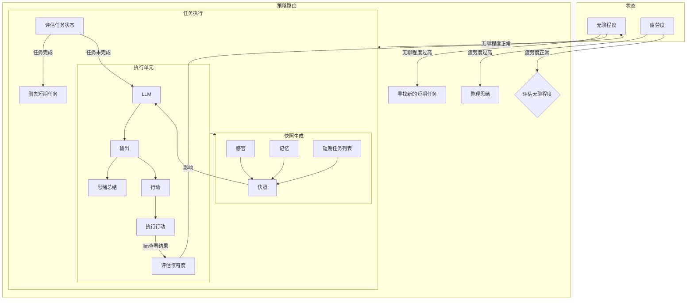

# Spinova

自用通用ai agent。

# 运行

```bash
sudo apt install protobuf-compiler
cargo run
```

## 架构


```mermaid
graph TD
    subgraph 状态
        无聊程度
        疲劳度
    end

    subgraph 快照生成
        感官 --> 快照
        记忆 --> 快照
        短期任务列表 --> 快照
    end

    subgraph 策略路由
        疲劳度 -- 疲劳度过高 --> 整理思绪
        疲劳度 -- 疲劳度正常 --> 评估无聊程度{评估无聊程度}
        无聊程度 -- 无聊程度过高 --> 寻找新的短期任务
        无聊程度 -- 无聊程度正常 --> 任务执行
    end

    subgraph 任务执行
        评估任务状态 -- 任务完成 --> 删去短期任务
        评估任务状态 -- 任务未完成 --> LLM
        subgraph 执行单元
            快照 --> LLM
            LLM --> 输出
            输出 --> 思绪总结
            输出 --> 行动
            行动 --> 执行行动
            执行行动 -- llm查看结果 --> 评估惊奇度
            评估惊奇度 -- 影响 --> 无聊程度
        end
        执行单元 --> 快照生成
    end
```
