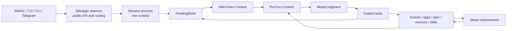

# Daat Locus Architecture

> This is the public architecture document for users and contributors. It
> describes the current implementation boundaries. For stricter coding rules,
> agent-facing constraints, and contribution policy, see `AGENTS.md` and
> `CONTRIBUTING.md`.

Daat Locus is a long-running local, tool-driven agent runtime. The runtime owns
durable state, claims structured work, injects structured context, exposes
explicit tools, executes tool calls, and records the resulting evidence. The
model's natural-language output is recorded as explanation; external effects are
produced by explicit tools and completion actions.

Its architecture is organized around explicit tool calls, stateful capability
domains, structured runtime context, isolated Sessions, and auditable evidence
for memory, skills, and sleep-time improvement.

## Design Goals

Daat Locus is built for work that improves through repeated practice:
maintaining projects over time, handling recurring task classes, remembering
practical experience, and turning that experience into auditable runtime assets.

The main design goals are:

1. **Tools produce external effects**

   Natural-language output provides explanations and records. Event completion,
   file edits, terminal commands, browser interaction, code edits, plan updates,
   skill binding, and other effects happen through explicit tools.

2. **State is explicit**

   The runtime stores events, pending work, app state, memory, plans, skill run
   bindings, session metadata, dashboard state, and delivery state. Code stores
   or renders mechanical state directly so model attention stays on semantic
   judgment.

3. **Capabilities stay in their domains**

   Browser, Terminal, and Coding are separate stateful capability domains. Their
   tools are namespaced and operate on explicit identifiers. The model calls
   each tool directly through its domain namespace.

4. **Mechanical work belongs to code**

   Queue enumeration, deduplication, freshness checks, delivery bookkeeping,
   schema validation, and evidence recording belong in code. The model spends
   attention on semantic judgment.

5. **Experience becomes auditable assets**

   Memory keeps continuity, but reusable procedures live in skill specs (SKILL.md files).
   Runtime errors and skill run evidence feed separate sleep-time improvement
   paths.

6. **Sessions are isolated runtimes**

   The public daemon is a Manager. Each Session process owns one runtime and is
   reached only through private local IPC from the Manager.

## Runtime Loop

The current high-level flow is:

1. A client or transport sends input to the Manager daemon.
2. The Manager chooses or creates the target Session and routes the input over
   private local IPC.
3. The Session registers an event or app notice and enqueues `PendingWork`.
4. The runtime claims one work item.
5. Newly claimed input and available skill context are injected once as AfterClaim
   Context.
6. Before every model turn, current execution state is injected as PreTurn
   Context.
7. The model makes semantic judgments and calls explicit tools.
8. Tools mutate state, apps, files, processes, events, plans, or skill run
   bindings.
9. Claimed work finishes through the appropriate completion tool.
10. The runtime records evidence needed by dashboard history, memory, skill run
    runs, and sleep-time improvement.



The important invariant is that tool results and persisted state are first-class
sources of truth alongside model judgment. They decide whether an action
actually happened.

## Runtime Context Model

Runtime context is split by lifetime in the current implementation.

### AfterClaim Context

AfterClaim Context is injected after work is claimed. It is one-shot context for
that claimed work:

- claimed events and claimed app notices;
- source metadata needed to handle them;
- the skill directory listing: available skill names, descriptions, and paths,
  so the model can discover and read skill content on demand.

It is one-shot claimed-work context. Event input lives here as part of the
claimed input record.

### PreTurn Context

PreTurn Context is injected before each model turn. It contains current
execution state that can change after tools run:

- sensory information such as current time and machine status;
- project instruction context when a coding project is in scope;
- the current plan;
- current skill run records and active skill context.

App state is read on demand through the generated `appid__get_state` tool for
Browser, Terminal, or Coding.

### Capability Docs Are Separate

Keep app docs, project instructions, event completion rules, and skill
routing as separate instruction layers with their own responsibilities.

## Core Runtime Objects

### Event

An `Event` is a structured external fact already received by the system. Current
Session code stores Telegram input and terminal/client user input as event
payloads. It represents work that needs semantic judgment and an explicit
disposition. Chat windows, selected conversations, and app cursors belong to
client or app state surfaces.

A claimed event ends through `finish_and_send`. `resolved` and `failed` require
a `reply_message` with content; `dismissed` is the silent completion path. Reply
delivery and event resolution happen through explicit completion tools.

### PendingWork

`PendingWork` is the scheduling unit for the next runtime turn. Current variants
are event work and app notice work. Events have priority over app notices.

The queue remains a scheduling layer that claims, releases, consumes, and
requeues work. Semantic judgment remains with the model and explicit tools.

### Plan

`Plan` is the short-term execution plan for the current task. Durable backlogs
and knowledge bases live in separate storage. An active plan with steps must have
exactly one `in_progress` step; completed plans are cleared after completion.

### Memory

Memory provides continuity and long-term recall. Runtime state and tool results
hold immediate facts for events, delivery, app state, and skill run records.

### Skills

A `Skill` is a reusable SOP specification stored as a `SKILL.md` file. Unlike
the old workflow/primitive system — which required explicit binding steps,
composition tools, and an evolution pipeline — the skill model is content-addressable
and discovery-based:

- The system prompt lists available skill names, descriptions, and file paths.
- The model reads a skill's `SKILL.md` through `read_file`, understands its
  instructions, and applies them directly.
- No explicit binding or composition tools exist. Skills are just markdown files
  the model reads and follows.
- Sleep self-improvement tracks which `SKILL.md` files the model has read and
  appends improvement patches under `## Sleep Improvements` sections.

Skill files live under `~/.agents/skills/` (builtin) and
`~/.daat-locus-workspace/skills/` (evolvable workspace skills). Builtin skills
are compiled into the binary and serve as read-only defaults.

## App Model

An `App` is a stateful capability domain with its own tools, state, lifecycle,
and prompt docs.

The current built-in Apps are:

- **Browser**: persistent page sessions, loading, semantic page snapshots,
  element refs, navigation, and page interaction.
- **Terminal**: persistent command sessions, unread output, stdin continuation,
  process lifecycle, and working directories.
- **Coding**: project-aware source operations backed by SCOPE — Semantic Code
  Operation & Propagation Engine (`scope-engine`), including semantic search,
  hash-anchored reads and edits, and propagation review.

### App Tool Exposure

An App is a direct namespaced tool domain. Runtime tool construction exposes
every installed App's valid tool specs directly under the App namespace, plus a
generated state tool:

```text
browser__get_state
browser__browser_open_page
terminal__get_state
terminal__terminal_exec
coding__get_state
coding__open_project
coding__search_code
```

The App still owns its state and lifecycle internally. Tool ownership is visible
in the tool name, and operations use explicit identifiers and visible runtime
selection inputs.

### State And Docs

Every App exposes two separate layers:

- `state`: current structured facts, returned by `appid__get_state` and rendered
  in app-status surfaces;
- `docs`: stable system-prompt documentation for operating the App's tools and
  understanding its capability boundary.

Keep these layers separate: state reports current facts, while docs explain
capability boundaries and safe operation. Only `state` belongs in runtime state
surfaces; `docs` are system prompt material. App docs are plain markdown, not a
frontmatter metadata layer; do not add app-level `description` or `when_to_use`
fields.

### Static File Tools Are Runtime Tools

`read_file` and `edit_file` are ordinary runtime tools. They handle explicit
path/range reads and hash-anchored edits for Markdown, TOML, YAML, JSON, shell
scripts, generated files, and paths outside SCOPE.

When a Coding project is open, source files owned by SCOPE require
`coding__edit_code` so parse validation and propagation review can run.

### Telegram Is A Transport

Telegram is a transport and event source. The Manager polls or receives
Telegram input, resolves access and default-session mapping, routes normal
messages to a Session, drains Session outboxes, and records delivery results.

The model receives the structured facts and event id from runtime, judges the
event, and completes it with `finish_and_send`.

### Workspace Apps

Third-party workspace Apps are source-first assets under:

```text
~/daat-locus-workspace/apps/<app_id_snake_case>/
  app.toml
  runtime/app.lua
  prompt/docs.md
```

The host loads one Lua 5.4 module from `runtime/app.lua` through `mlua`. The
current Lua surface uses one module instance with hooks such as `config(ctx)`,
`init(ctx, state)`, `render_state(ctx, state)`, `list_tools(ctx, state)`,
`call_tool(ctx, state, name, args)`, and `poll_notices(ctx, state)`.

Workspace app prompt docs describe the App capability. Reusable task SOPs live in
skill specs (SKILL.md files).

## Tool And Action Boundaries

### Prefer Explicit Identifiers

Tool calls should bind to concrete identifiers or freshness guards:

- event completion binds to the claimed event;
- Browser calls bind to `page_id` and, for interactions, `element_ref`;
- Terminal continuation binds to `session_id`;
- Coding reads and edits bind to `path + line#hash`;
- session APIs bind to opaque `session_id` values;
- skill reading uses named skill paths.

Explicit identifiers make stale-state mistakes auditable.

### Coding And File Editing Boundary

Coding uses one visible source-location vocabulary: `path + line#hash`.

- `coding__search_code` returns matched source lines with path-scoped anchors.
- `coding__read_code` reads a path plus anchor in `around` or `full` mode.
- `coding__edit_code` applies structured hash-anchored edits and returns
  propagation results.
- `coding__next_review` exposes pending impact review events after edits.

Explicit path/range reads belong to `read_file`; `read_code` handles path plus
anchor. Configuration, generated, and outside-SCOPE edits belong to `edit_file`;
SCOPE source edits belong to `edit_code`.

### Model-Facing Schema Dialect

Runtime tools, App tools, and structured model outputs use a conservative JSON
Schema dialect. Schemas are root objects, object properties are required and
closed with `additionalProperties: false`, optional values are nullable required
fields, and correctness comes from generated and validated schemas at the
provider boundary.

The normal Rust entry point is `#[model_schema]` plus `model_schema_for::<T>()`.
Dynamic workspace app schemas are validated when loaded.

## Multi-Session Architecture

Daat Locus is a client-server multi-session system.

```text
WebUI / TUI / CLI / Telegram control
  -> Manager daemon public API
  -> Session process over private local IPC
```

Clients connect only to the Manager daemon. Session processes are private
runtime workers; the Manager is the public client target.

### Manager Responsibilities

The Manager owns:

- public HTTP/WebSocket endpoints and embedded WebUI serving;
- daemon authentication and token validation;
- session registry and lifecycle;
- spawning, stopping, restarting, deleting, and health-checking sessions;
- routing `/send`, dashboard requests, command requests, and Telegram input;
- Telegram ACL, default-session mapping, outbox delivery, and Telegram-only
  session control commands;
- dashboard snapshot/history/stream proxying from target Sessions.

The Manager stays at public API, auth, routing, lifecycle, and compact status
summary boundaries. Runtime `Context` creation, model loop execution, and
per-session memory/event/app/plan ownership belong to Session processes.

### Session Responsibilities

Each Session process owns exactly one runtime:

- one `Context`;
- one `EventStore` and `PendingWorkQueue`;
- one conversation and memory state;
- one `Plan`;
- one `AppManager` and app instance set;
- one dashboard state stream;
- one model loop.

A Session exposes private IPC handlers to the Manager. Public HTTP serving,
global session registry loading, multi-session management, and Telegram polling
belong to the Manager.

### Session Registry And Code Mode

The Manager persists session metadata, including an opaque `session_id`, scope,
process status, IPC metadata, optional project directory, title, and timestamps.
Public session lists expose only user-facing identity, title, scope, and basic
summary fields; IPC tokens and process internals remain Manager-private.

`daat-locus run` works with general sessions. `daat-locus code <project-dir>`
canonicalizes the project directory and shows only project-scoped sessions for
that path. Creating a code session creates a new opaque `session_id`; a project
directory can have multiple code sessions.

### Manager-Session IPC

Manager and Session communicate with `interprocess` Tokio local sockets. The
protocol uses framed JSON envelopes with protocol version, request id, session
id, IPC token, and request body. Requests include status, user input submission,
dashboard snapshot/history/stream, dashboard commands/actions, Telegram event
queueing, Telegram outbox draining, delivery recording, requeueing, and
shutdown.

This IPC is a local implementation boundary for Manager/Session coordination.

### Telegram Routing

Approved Telegram chats are mapped by the Manager to a default Session. If a
chat lacks a valid mapping, the first ordinary message creates a new general
Session and stores the mapping. Telegram-only session commands such as
`/session_list`, `/session_new`, `/session_attach`, and `/session_delete` are
handled by the Manager before Session event registration. Ordinary chat messages
are routed to Session event stores as runtime events.

## Dashboard And Interactive Clients

`DashboardState` is the shared cross-client session/runtime snapshot produced by
the Session and consumed by TUI, WebUI, and other clients. It includes activity
cells, live activity, runtime status, plan summaries, app status output, skills,
Telegram access requests, token usage, and context/optimization summaries.

TUI local interaction state belongs to `TuiViewState`: command input, slash
completion, panels, scroll offsets, local feedback, expanded display choices,
history paging state, and render caches. Multiple TUI clients can show the same
`DashboardState` with different `TuiViewState` values.

The TUI architecture is:

```text
DashboardState + TuiViewState
  -> input_controller reducer
  -> optional DashboardCommandRunner effect
  -> FrameRequester schedule
  -> pure full-frame render
```

`FrameRequester` is the draw scheduler. The TUI uses full-frame renders,
coalesced draw requests, and animation scheduling through `FrameRequester`.

Slash commands are top-level product entry points. Commands such as `/skills`,
`/debug`, `/app-status`, and `/status` should open panels or one obvious action.
Large typed CLI trees stay in internal, remote-control, or test surfaces.

WebUI session rendering reads structured `DashboardState`, `WebActivityItem`,
and `ActivityCell` data directly while mirroring the TUI session activity
hierarchy.

## Sleep And Self-Improvement

Sleep is evidence-driven improvement with two independent paths:

- **Runtime Error Correction** consumes code-detected runtime/protocol error
  cases and produces small global runtime contract corrections.
- **Skill Improvement** consumes skill run records and patches the skill's
  SKILL.md with improvement suggestions.

Keep these paths separate: runtime protocol errors feed contract corrections;
skill run quality evidence feeds skill patch decisions.

## Persistence Boundaries

Protected runtime state includes configuration, daemon auth tokens, Telegram
ACL/default-session mapping, session registry, events, pending work, runtime
conversation and memory, plans, dashboard history, app-local state, and sleep
artifacts.

Editable workspace assets include project files, workspace app source packages,
and skill specs. Builtin skill specs are repository assets
compiled into the binary and are read-only at runtime.

This boundary separates runtime-owned state from project-file edits while still
allowing agent-maintained workspace assets to evolve through controlled
processes.

## Current Architecture Shape

### Work Queue Runtime

Daat Locus can expose chat-like interfaces, while its core is pending work,
structured context, explicit tools, persisted state, and evidence.

### Domain-Owned Tools

Tools are exposed by domain ownership. App tool names show their owner namespace,
and stateful domains expose `get_state` with explicit identifiers.

### Source-First Workspace Apps

Workspace Apps are source-first, local, auditable capability domains. Skill
specs carry self-optimizing task procedures.

### Evidence-Driven Improvement

Self-improvement requires evidence, an ownership layer, persistent artifacts,
and auditable changes.

## Summary

Daat Locus can be summarized by a few current invariants:

- external effects flow through explicit tools and completion actions;
- Apps are stateful capability domains with direct namespaced tools;
- Events and PendingWork are separate from Apps;
- runtime context is split into AfterClaim and PreTurn layers;
- Manager is the only public server, and Sessions are private runtime workers;
- skills are reusable SOP specifications discovered and read as markdown files;
- sleep consumes explicit evidence through separate runtime-error and skill
  improvement paths.

The goal is a local agent runtime that can act, verify, remember, and improve
while remaining auditable and shaped by human judgment.
