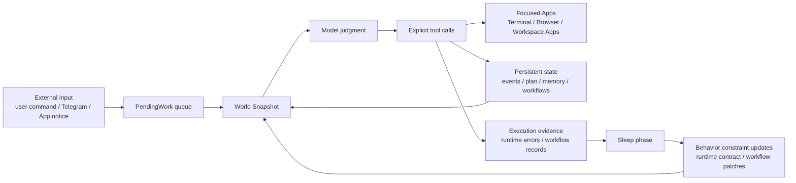

# Daat Locus Architecture

> This is a public architecture document for users and contributors. It
> explains why Daat Locus is designed this way, and how its core concepts work
> together. For finer coding constraints, implementation boundaries, and
> contribution rules, refer to `AGENTS.md` and `CONTRIBUTING.md`.

Daat Locus is a long-running local agent runtime. Its goal is not to wrap an
LLM into a question-answering chatbot, but to place the LLM inside an
action-oriented system governed by the runtime: external events enter a queue,
the runtime renders the current world state, the model makes semantic judgments
and calls tools, tools explicitly change the world, and execution evidence is
distilled into workflows and sleep-time improvement.

In other words, the center of Daat Locus is not "conversation". It is **the
world state of a continuously running system**.

## Design Goals

Daat Locus is built for work that becomes better through long-term practice:
maintaining the same project, repeatedly handling the same class of task, using
the same set of tools across continuous work, and gradually adapting to the
user's judgment through human-in-loop feedback.

It aims to solve several common agent design problems:

1. **Text is mistaken for action**

   In many agent systems, once the model says "I have completed this", the
   system treats the task as complete. Daat Locus does not. Changes to the
   external world must happen through explicit tool calls.

2. **Flat tool lists scatter attention**

   When every tool is exposed to the model at the same time, the model can
   easily lose track of the software surface it is currently operating. Daat
   Locus uses the App model to make tools local, stateful, and focusable.

3. **Experience stays only in chat memory**

   Ordinary memory can help an agent remember what happened, but it does not
   necessarily create a more stable way to act. Daat Locus distills repeated
   tasks into workflows, then improves them during sleep based on execution
   evidence.

4. **Self-improvement is too generic**

   Daat Locus does not define self-improvement as vague reflection by the
   model. It separates improvement by evidence source: runtime protocol errors
   are used to correct global runtime contracts, while workflow execution
   records are used to improve reusable task procedures.

5. **Human feedback is hard to compound over time**

   Daat Locus is not trying to replace human judgment. Its goal is to turn
   high-quality human-in-loop feedback into executable long-term constraints:
   workflows, tests, tool boundaries, approval rules, and runtime invariants.

## Core Principles

### Text Is Not Action

Natural-language model output is usually an explanation, draft, or intermediate
record. It does not automatically become an external-world action.

To reply to a Telegram message, the model must use an event completion tool.
To edit files, it must use an explicit file or patch tool.
To finish an app notice, it must use the corresponding resolution tool.
To change a long-term workflow, it must go through sleep or a controlled
workflow change process.

This principle lets Daat Locus distinguish:

- what the model said;
- what the model intended to do;
- what the runtime actually recorded;
- whether the external world was really changed.

### The Runtime Owns World State

Daat Locus does not treat chat context as the only source of truth. The runtime
maintains and renders the current world state, including pending events, the
current plan, bound workflows, the foreground App, App state, long-term memory
recall, system time, machine state, and more.

Each model turn sees an organized world snapshot, not an undifferentiated pile
of message history.

### Code Handles Mechanical Work, The Model Handles Semantics

Daat Locus tries to avoid making the model do mechanical tasks that code can
perform reliably, such as:

- enumerating queues;
- deduplication;
- finding the latest event;
- maintaining an outbox;
- deciding whether an id is stale;
- recording workflow execution evidence;
- persisting state.

The model should handle semantic judgment: whether to respond, how to respond,
whether to focus an App, whether to bind a workflow, and which tool to call
next.

This does not weaken the model. It lets the model spend attention on what
actually requires intelligence.

### Experience Is An Executable Asset, Not Just Memory

Daat Locus uses long-term memory for contextual continuity, but it values
"executable experience" more: how a class of task should be done, which steps
tend to fail, which boundaries need to be clearer, and which processes are
worth reusing.

These experiences are modeled as workflows, not merely written into chat memory
or a profile.

### Self-Improvement Must Be Auditable

The sleep phase in Daat Locus should not mysteriously "make the agent smarter".
Any persistent behavior change should be able to answer:

- what evidence produced this change;
- which layer the change affects;
- whether it is a global runtime contract or a task-class workflow;
- whether it can be rolled back;
- whether it requires human review.

## Overall Runtime Model

The basic Daat Locus loop can be summarized as:

1. External input or an App notice enters pending work.
2. The runtime claims one piece of work.
3. The runtime assembles the current world snapshot.
4. The model makes judgments based on the snapshot.
5. The model acts explicitly through tools.
6. The runtime executes tools and records results.
7. If the work has not been explicitly completed, the runtime keeps asking the
   model to handle it.
8. After work completes, the runtime records necessary evidence.
9. During sleep, the runtime organizes this evidence and improves runtime
   contracts or workflows.

The key point is: **the model is not the runtime's only source of truth. Tool
results and persistent state are the basis for whether an action actually
happened.**

## Core Objects

### Event

An Event is a structured external fact the system has already received. It
usually means "something happened in the outside world, and the agent needs to
make a semantic judgment".

An Event is not a chat window or an internal App cursor. It answers:

- what happened;
- whether a response is needed;
- what disposition should end it;
- if a response is needed, what final content should be sent.

For example, a new Telegram message is converted by the transport into an Event
and then enters pending work. When the model handles this event, it does not
need to "open a Telegram App and find the message". The runtime already knows
which message it is, which chat it came from, and which event id it belongs to.

### PendingWork

PendingWork is the scheduling unit that drives the next runtime step. It may
come from an Event or from a background App notice.

PendingWork is only responsible for scheduling, not business judgment. It
should not become another hidden state machine, and it should not carry
long-term semantics.

### World Snapshot

World Snapshot is the current world summary the model sees before each
judgment. It organizes scattered runtime state into context the agent can
understand.

A typical snapshot includes:

- current time and machine state;
- current plan;
- currently bound workflow;
- candidate workflow summaries;
- pending event summary;
- current foreground App and App state;
- automatically recalled long-term memories;
- necessary tool-use constraints.

The goal of a snapshot is not to stuff every log into the model. It is to
provide enough judgment material and avoid meaningless mechanical exploration.

### Plan

Plan is the current task's short-term execution plan. It helps the model retain
step awareness, but it is not a backlog, not a long-term knowledge base, and
not an event list.

A healthy plan should serve the current task: what to do next, which step is in
progress, and whether it should be cleared after completion.

### Memory

Memory provides contextual continuity and long-term experience recall. It can
help the model understand user preferences, historical background, project
experience, and previous decisions.

But Memory should not be treated as an immediate state cache. Event state, App
state, workflow binding, delivery state, and similar facts should be persisted
and rendered by the runtime, not guessed by the model from memory.

### Workflow

Workflow is an execution specification for a reusable class of tasks. It is not
an App manual, not an innate model capability, and not a long-term copy of the
current plan.

Workflow answers:

- what kinds of tasks are worth handling through a stable process;
- what order they usually proceed in;
- what counts as completion;
- how to recover from blockers or failures;
- which constraints must be repeatedly followed.

Daat Locus separates three workflow layers:

- **WorkflowSpec**: the workflow itself, an execution specification readable by
  the agent;
- **WorkflowBinding**: whether the current task is bound to a workflow, a piece
  of runtime state;
- **WorkflowRunRecord**: evidence left after daytime execution for sleep-time
  workflow improvement.

This layering matters. WorkflowSpec does not carry runtime state such as
"currently active"; WorkflowBinding should not be written back into the
workflow itself; WorkflowRunRecord is recorded automatically by the runtime and
should not be manually written by the model.

## App Model

### Apps Are Stateful Operating Surfaces

In Daat Locus, an App is not a normal plugin or toolkit. An App is a stateful
runtime surface the agent observes and acts upon.

When humans use a computer, we do not choose actions from a "global list of all
possible operations". We open a terminal, read output, type a command, and wait
for the result; or we open a browser, read the current page, click, navigate,
and continue from the new page.

Daat Locus gives agents a similar interaction model.

An App provides at least three layers of information:

- **state**: the currently visible state;
- **usage**: when this App is appropriate;
- **how_to_use**: how to operate it after focus.

These three layers should not be mixed. State is not a tutorial; usage is not a
complete operating manual; how_to_use is not current world fact.

### Why Focus Exists

Focus is not ceremonial. Its purpose is to localize the model's attention and
tool space.

When Terminal is focused, the model cares about shell sessions, command output,
stdin, and whether a process is still running.
When Browser is focused, the model cares about page content, navigation state,
element references, and whether the page has finished loading.
When a workspace app is focused, the model cares about that app's exposed
state, notices, and local tools.

This is more stable than exposing all tools to the model all the time, because
the model always knows which software surface it is operating.

### Terminal And Browser

Terminal is an App because it has temporal semantics such as persistent
sessions, output waiting, stdin writes, process termination, and working
directories.

Browser is an App because page content is local and mutable. Clicking,
navigating, waiting for loads, and rereading the page all affect whether later
operations can continue.

Both Apps express a core Daat Locus view: **tool calls are not isolated
functions, but continuous actions on a stateful software surface.**

### Why IM Interfaces Such As Telegram Are Not Apps

In Daat Locus, Telegram is a transport and event source, not an App.

The reason is that when a Telegram message arrives, the runtime already knows
enough structured facts: message content, source chat, event id, whether the
contact is known, and so on. The standard handling path is "judge and complete
this event", not "open a Telegram UI, select a chat, then find the message".

If Telegram were modeled as an App, the system would easily introduce hidden
cursors: which chat is currently open, which message is selected, whether send
depends on UI state, and so on. That would weaken the auditability of event
completion.

Therefore, Telegram messages enter as Events. Replies go through explicit
completion tools into an outbox, then the transport delivers them
asynchronously.

## Tool And Action Boundaries

Daat Locus treats tools as explicit interfaces for changing world state. A tool
call should clearly state what it reads, what it changes, which explicit
parameters it needs, and how failure is recorded.

### Prefer Explicit Identifiers

Tool parameters should use clear ids whenever possible, instead of relying on a
hidden "currently selected object".

For example:

- event completion should bind to a concrete event id;
- Browser operations should bind to a concrete page and element reference;
- Terminal operations should bind to a concrete session;
- Workflow binding should point to a specific workflow.

The purpose is to prevent mistakes caused by stale state and hidden cursors.

### App-Scoped Tools

Tools that belong to an App should only be exposed and used in an appropriate
App context. Browser tools should not secretly execute from any context;
Terminal tools should not bypass Terminal's state surface.

This lets every model action answer: "Which App state am I operating right
now?"

### Event Completion Tools

The final handling of an external event must go through a completion tool.
Natural-language text can explain, but it cannot replace completion.

Only then can the runtime know whether the event was resolved, whether a
message should be sent, whether the message entered the outbox, whether the
transport delivered it successfully, and whether failure needs retrying or
recording.

## Workflow And Experience Compounding

Daat Locus is long-running not only because of memory, but also because of
workflow.

When an agent repeatedly handles the same class of task, merely "remembering
what happened before" is not enough. More important is forming a stable way to
act: which steps work, which prerequisite judgments are necessary, which
failures are worth avoiding in advance, and which actions require human-in-loop
approval.

Workflow is the executable carrier for that experience.

### Workflow Is Not Prompt

A Workflow can be read by the model, but it is not an ordinary prompt. It is an
execution asset managed by the runtime, with an id, applicability, procedure,
completion criteria, and evolution history.

This means a workflow can be selected, bound, have execution results recorded,
and be corrected during sleep.

### Builtin Workflows And Workspace Workflows

Daat Locus distinguishes foundational builtin workflows from evolvable
workspace workflows.

Builtin workflows are more like a base capability layer. They are usually
shipped with the code repository and should not be automatically modified by
sleep.

Workspace workflows are local execution experience distilled from long-term
practice. They can be gradually improved through human-in-loop and sleep
mechanisms.

### Workflow Evolution

The goal of workflow evolution is not to let the agent randomly rewrite its own
behavior. It is to correct the process for a class of tasks based on real
execution evidence.

Typical improvements include:

- adding necessary prerequisite checks;
- clarifying completion criteria;
- fixing steps that repeatedly fail;
- adding human approval conditions;
- merging duplicate or highly similar workflows.

This is not one-off prompt engineering. It is a long-term maintenance process.

## Sleep Phase

Sleep is the asynchronous organization and improvement phase in Daat Locus. It
should not be understood as "letting the model casually reflect while resting".

The core role of sleep is to turn evidence left by daytime runtime execution
into more stable future behavior.

### Two Kinds Of Evidence

Daat Locus mainly distinguishes two kinds of evidence:

1. **Runtime protocol errors**

   These errors mean the model violated a global runtime contract or tool
   protocol. Examples include failing to explicitly complete an event, using
   tool arguments that do not match schema, continuing the wrong session, using
   stale references, and so on.

2. **Workflow execution records**

   These records come from real task execution bound to a workflow. They show
   whether a workflow works smoothly in practice, which steps are effective,
   and where the workflow may need patching or merging.

### Two Improvement Paths

Daat Locus splits sleep-time improvement into two independent paths:

- **Runtime Error Correction**: corrects global runtime contracts and tool
  protocol constraints to prevent repeated runtime errors of the same kind;
- **Workflow Improvement**: improves workspace workflows based on workflow
  execution records, making repeated task processes better match practice.

These paths must not be confused. A runtime protocol error should not directly
become a task workflow step. A workflow execution quality issue should not be
casually attributed to a global prompt or runtime contract.

### Why Not Generic Reflection

Generic reflection can produce negative compounding. The model may turn an
accident into a rule, or overfit tests into goals.

Daat Locus leans toward evidence-driven improvement: behavior assets should
change only when the evidence is clear enough for the corresponding layer.
Errors that code can detect should be detected by code. High-risk changes that
require human value judgment should keep human approval.

## Human-In-Loop And Self-Shaping

Daat Locus does not pursue unconstrained autonomy. It is better suited to a
human-guided self-improvement mode: humans provide direction, abstraction
boundaries, risk judgment, and final approval; the runtime handles execution,
verification, recording, review, and distillation.

The key in this mode is not letting the agent replace human judgment, but making
high-quality human feedback compound.

For example, a developer may repeatedly point out:

- a certain class of changes must not only edit prompts, but add runtime guards;
- high-risk paths require human approval;
- tool visibility must be enforced not only at display time, but also at
  execution time;
- transports should not be modeled as Apps;
- the model should not do mechanical work that code can complete reliably.

If this feedback only stays in chat, it is quickly lost. Daat Locus aims to
turn it into workflows, tests, approval rules, runtime constraints, or
documentation standards, so it becomes the default structure for the next
action.

This is also an important difference between Daat Locus and ordinary one-shot
coding agents: it is more like a local maintenance runtime that is shaped by
the user over time.

## Third-Party Workspace Apps

Daat Locus supports a source-first workspace app direction. Third-party Apps are
not external black-box plugins, but source-code assets located in the local
workspace that the agent can read and modify.

This design has several goals:

- make app behavior auditable;
- let the agent modify and maintain apps under human-in-loop;
- avoid introducing complex ABIs or remote plugin systems too early;
- preserve the separation between usage, how_to_use, and runtime code.

Third-party App documentation should not be put into workflow. An App describes
"what this software surface is, when to use it, and how to operate it"; a
workflow describes "how a class of task should be completed". The two must stay
separate.

## Daemon And Persistent State

Daat Locus runs by default as a daemon. The foreground TUI, Telegram transport,
control interface, and runtime loop all work around the same long-running
state.

The daemon model lets Daat Locus:

- continuously receive external events;
- preserve App, workflow, memory, and pending work state;
- continue handling background work even when the user is not actively typing;
- organize execution evidence during sleep;
- provide an attachable foreground interface.

Persistent state usually falls into two categories:

- **protected runtime state**: configuration, events, memory, transport state,
  sleep artifacts, and similar runtime-owned data;
- **editable workspace assets**: workspace apps, workspace workflows, project
  files, and similar agent-editable assets.

This distinction matters. Runtime state should not be casually rewritten by the
agent as ordinary project files. Workspace assets can be edited and evolved by
the agent through controlled processes.

## Differences From Common Agent Shapes

### Not Centered On Chat Sessions

Daat Locus may have conversation interfaces, but its core is not the session.
Its core is long-running runtime state, pending work, world snapshots,
tool-mediated actions, and sleep evidence.

### Not Centered On Subagents

Daat Locus does not by default split tasks across multiple temporary subagents,
because that weakens responsibility attribution and experience compounding. It
leans toward a single authoritative runtime, multiple App surfaces, multiple
workflow assets, and isolated workers when necessary.

If workers are introduced in the future, they should be controlled analysis,
evaluation, or sandbox execution units, not a second main agent with independent
world state.

### Apps Are Not Plugins

Plugins are usually capability extensions. Apps are focusable, stateful
software surfaces that render current state and expose local tools.

### Self-Improvement Is Not Reflection Text

Daat Locus self-improvement is not "write a paragraph about what I did wrong".
It requires evidence, ownership layer, persistent assets, and auditable changes.

## Summary

The core of Daat Locus is not "giving the model more tools". It is letting the
model act inside a long-running, auditable, reviewable, human-shaped runtime.

Its architecture can be condensed into a few sentences:

- text is not action, tools change the world;
- the runtime owns world state, and the model makes semantic judgments from a
  snapshot;
- Apps are stateful operating surfaces, not flat toolkits;
- Workflows are reusable execution experience, not chat memory;
- Sleep consumes execution evidence, not vague reflection;
- Human-in-loop is not an obstacle to autonomy, but the source of positive
  compounding.

Daat Locus is not trying to create an autonomous system detached from human
judgment. It is trying to build a personal agent runtime that can receive
feedback over time, distill experience, and adapt to the user's way of working.
