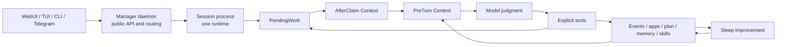

# Daat Locus 架构说明

> 本文是面向使用者和贡献者的公开架构说明，描述当前实现中的边界。更严格的编码规则、agent-facing 约束和贡献政策见 `AGENTS.md` 与 `CONTRIBUTING.md`。

Daat Locus 是一个长期运行在本地、由工具驱动的 agent runtime。Runtime 拥有持久状态，认领结构化工作，注入结构化上下文，暴露显式工具，执行工具调用，并记录由此产生的证据。模型的自然语言输出会成为解释或记录；外部效果由显式工具和 completion actions 产生。

当前架构围绕显式工具调用、有状态能力域、结构化 runtime context、隔离的 Sessions，以及可审计的 memory、skills 和 sleep-time improvement 证据组织。

## 设计目标

Daat Locus 面向会从反复实践中变好的工作：长期维护项目、处理重复任务类型、记住实践经验，并把经验转化为可审计的 runtime 资产。

主要设计目标是：

1. **工具产生外部效果**

   自然语言输出提供解释或记录。事件完成、文件编辑、终端命令、浏览器交互、代码编辑、plan 更新、skill 绑定等外部效果都通过显式工具发生。

2. **状态保持显式**

   Runtime 保存 events、pending work、App state、memory、plan、skill run records、session metadata、dashboard state 和 delivery state。代码直接存储和渲染机械状态，模型注意力放在语义判断上。

3. **能力保留各自 domain**

   Browser、Terminal、Coding 是分离的有状态能力域。它们的工具有 namespace，并绑定显式标识符。模型通过对应 domain namespace 直接调用工具。

4. **机械工作归代码**

   队列枚举、去重、freshness 检查、delivery bookkeeping、schema validation 和 evidence recording 由代码完成。模型把注意力放在语义判断上。

5. **经验成为可审计资产**

   Memory 保持连续性；可复用流程存入 skill specs（SKILL.md 文件）。Runtime errors 和 skill run evidence 会进入相互独立的 sleep-time improvement 路径。

6. **Session 是隔离 runtime**

   公开 daemon 是 Manager。每个 Session process 拥有一个 runtime，只能由 Manager 通过私有本地 IPC 访问。

## Runtime 循环

当前高层流程是：

1. 客户端或 transport 把输入发送给 Manager daemon。
2. Manager 选择或创建目标 Session，并通过私有本地 IPC 转发输入。
3. Session 注册 event 或 app notice，并入队 `PendingWork`。
4. Runtime 认领一个 work item。
5. 新认领输入和可用 skill context 作为一次性的 AfterClaim Context 注入。
6. 每一轮模型调用前，当前执行状态作为 PreTurn Context 注入。
7. 模型做语义判断并调用显式工具。
8. 工具修改 state、apps、files、processes、events、plans 或 skill run records。
9. 已认领工作通过对应 completion tool 完成。
10. Runtime 记录 dashboard history、memory、skill run records 和 sleep-time improvement 需要的 evidence。



关键事实是：工具结果和持久状态与模型判断共同构成 runtime 的事实来源，并决定动作是否真实发生。

## Runtime Context 模型

当前实现按生命周期拆分 model-facing runtime context。

### AfterClaim Context

AfterClaim Context 在工作被认领后注入。它是这项已认领工作的 one-shot context：

- 已认领 events 和 app notices；
- 处理它们所需的 source metadata；
- skill 目录列表：可用 skill 名称、描述和路径，供模型按需发现和读取 skill 内容。

它是 claimed work 的一次性 context。Event input 作为 claimed input record 的一部分位于这里。

### PreTurn Context

PreTurn Context 在每轮模型调用前注入。它包含工具调用后可能变化的当前执行状态：

- 当前时间、机器状态等 sensory 信息；
- coding project in scope 时的 project instruction context；
- 当前 plan；
- 当前 skill run records 和活跃 skill 状态。

App state 通过 Browser、Terminal 或 Coding 对应的 `appid__get_state` 工具按需读取。

### Capability Docs 独立存在

App docs、project instructions、event completion rules 和 skill 路由保持为各自 instruction layers，并承担各自职责。

## 核心 Runtime 对象

### Event

`Event` 是系统已经收到的结构化外部事实。当前 Session 代码会把 Telegram input 和 terminal/client user input 存成 event payload。它表示需要语义判断并给出显式 disposition 的工作。聊天窗口、选中的 conversation 和 App cursor 属于客户端或 App state surface。

已认领 event 通过 `finish_and_send` 结束。`resolved` 和 `failed` 需要包含内容的 `reply_message`；`dismissed` 是静默完成路径。回复发送和 event resolution 通过显式 completion tools 完成。

### PendingWork

`PendingWork` 是驱动下一轮 runtime 的调度单位。当前变体是 event work 和 app notice work。Events 优先于 app notices。

队列保持调度层职责：claim、release、consume 和 requeue work。语义判断仍由模型和显式工具完成。

### Plan

`Plan` 是当前任务的短期执行计划。Backlog 和持久知识库由其他存储承担。包含步骤的 active plan 必须正好有一个 `in_progress` step；任务完成后清空 plan。

### Memory

Memory 提供上下文连续性和长期召回。Runtime state 和 tool results 保存 events、delivery、app state 或 skill run records 的即时事实。

### Skills

`Skill` 是以 `SKILL.md` 文件形式存储的可复用 SOP specification。与旧的 workflow/primitive 系统（需要显式绑定步骤、组合工具和演化流水线）不同，skill 模型是基于内容寻址和发现驱动的：

- System prompt 列出可用 skill 的名称、描述和文件路径。
- 模型通过 `read_file` 读取 skill 的 `SKILL.md`，理解指令后直接应用。
- 没有显式的绑定或组合工具。Skills 只是模型读取和遵循的 markdown 文件。
- Sleep 自我改进会追踪模型读取了哪些 `SKILL.md` 文件，并在 `## Sleep Improvements` 节下附加改进 patch。

Skill 文件位于 `~/.agents/skills/`（内置）和 `~/.daat-locus-workspace/skills/`（可演化的 workspace skills）。Builtin skills 编译进 binary，在运行时只读。

## App 模型

`App` 是有状态能力域，拥有自己的 tools、state、lifecycle 和 prompt docs。

当前内置 App 是：

- **Browser**：持久 page sessions、loading、语义 page snapshots、element refs、navigation 和 page interaction。
- **Terminal**：持久 command sessions、unread output、stdin continuation、process lifecycle 和 working directories。
- **Coding**：由 SCOPE — Semantic Code Operation & Propagation Engine（`scope-engine`）支撑的项目级 source operations，包括 semantic search、hash-anchored reads/edits 和 propagation review。

### App Tool Exposure

App 是直接 namespace tool domain。Runtime tool construction 会把每个已安装 App 的有效 tool specs 直接暴露在 App namespace 下，并额外生成 state tool：

```text
browser__get_state
browser__browser_open_page
terminal__get_state
terminal__terminal_exec
coding__get_state
coding__open_project
coding__search_code
```

App 仍然在内部拥有 state 和 lifecycle。Tool ownership 体现在工具名里，操作使用显式标识符和可见 runtime selection inputs。

### State 与 Docs

每个 App 暴露两层信息：

- `state`：当前结构化事实，由 `appid__get_state` 返回，并在 app-status surface 中渲染；
- `docs`：稳定的 system-prompt 文档，用于说明 App 的能力边界和如何安全操作工具。

这两层保持分离：state 报告当前事实，docs 说明能力边界和安全操作方式。只有 `state` 属于 runtime state surface；`docs` 只属于 system prompt。App docs 是普通 markdown，不是 frontmatter metadata 层；不要添加 app 级 `description` 或 `when_to_use` 字段。

### 静态文件工具是 Runtime Tools

`read_file` 和 `edit_file` 是普通 runtime tools。它们处理 Markdown、TOML、YAML、JSON、shell scripts、generated files 和 SCOPE 外路径的显式 path/range read 与 hash-anchored edit。

当 Coding project 已打开时，SCOPE 拥有的 source file 需要使用 `coding__edit_code`，这样 parse validation 和 propagation review 才能运行。

### Telegram 是 Transport

Telegram 是 transport 和 event source。Manager 负责 poll/receive Telegram input、处理 access 和 default-session mapping、把普通消息路由到 Session、drain Session outbox，并记录 delivery result。

模型从 runtime 获得结构化事实和 event id，判断 event，并用 `finish_and_send` 完成它。

### Workspace Apps

第三方 workspace Apps 是 source-first 资产，位于：

```text
~/daat-locus-workspace/apps/<app_id_snake_case>/
  app.toml
  runtime/app.lua
  prompt/docs.md
```

Host 通过 `mlua` 从 `runtime/app.lua` 加载一个 Lua 5.4 module。当前 Lua surface 使用单一 module instance，hooks 包括 `config(ctx)`、`init(ctx, state)`、`render_state(ctx, state)`、`list_tools(ctx, state)`、`call_tool(ctx, state, name, args)` 和 `poll_notices(ctx, state)`。

Workspace app prompt docs 描述 App 能力；可复用任务 SOP 位于 skill specs（SKILL.md 文件）。

## 工具与行动边界

### 显式标识符优先

工具调用应绑定到具体 id 或 freshness guard：

- event completion 绑定到已认领 event；
- Browser 调用绑定 `page_id`，交互操作还要绑定 `element_ref`；
- Terminal continuation 绑定 `session_id`；
- Coding reads/edits 绑定 `path + line#hash`；
- session APIs 绑定 opaque `session_id`；
- skill 读取使用命名 skill 路径。

显式标识符让 stale-state 错误可审计。

### Coding 与文件编辑边界

Coding 使用一种可见 source-location vocabulary：`path + line#hash`。

- `coding__search_code` 返回带 path-scoped anchors 的 matched source lines。
- `coding__read_code` 读取 path plus anchor，mode 为 `around` 或 `full`。
- `coding__edit_code` 应用 structured hash-anchored edits，并返回 propagation results。
- `coding__next_review` 在编辑后暴露 pending impact review events。

显式 path/range read 属于 `read_file`；`read_code` 处理 path plus anchor。配置、generated 和 SCOPE 外编辑属于 `edit_file`；SCOPE source edits 属于 `edit_code`。

### Model-Facing Schema Dialect

Runtime tools、App tools 和 structured model outputs 使用保守 JSON Schema dialect。Schema root 必须是 object；object properties 必须 required，并用 `additionalProperties: false` 关闭；optional values 表示为 nullable required fields；正确性来自生成并验证后的 provider-boundary schemas。

Rust 侧通常使用 `#[model_schema]` 加 `model_schema_for::<T>()`。动态 workspace app schemas 会在加载时校验。

## Multi-Session 架构

Daat Locus 是 client-server multi-session system。

```text
WebUI / TUI / CLI / Telegram control
  -> Manager daemon public API
  -> Session process over private local IPC
```

客户端只连接 Manager daemon。Session processes 是私有 runtime workers，公开 client target 是 Manager。

### Manager 职责

Manager 拥有：

- public HTTP/WebSocket endpoints 和 embedded WebUI serving；
- daemon authentication 和 token validation；
- session registry 和 lifecycle；
- session spawn、stop、restart、delete、health check；
- `/send`、dashboard requests、command requests 和 Telegram input 的路由；
- Telegram ACL、default-session mapping、outbox delivery 和 Telegram-only session control commands；
- 从目标 Sessions proxy dashboard snapshot/history/stream。

Manager 保持 public API、auth、routing、lifecycle 和 compact status summary 边界。Runtime `Context` 创建、model loop 执行，以及 per-session memory/event/app/plan 所有权属于 Session processes。

### Session 职责

每个 Session process 拥有且只拥有一个 runtime：

- 一个 `Context`；
- 一个 `EventStore` 和 `PendingWorkQueue`；
- 一份 conversation 和 memory state；
- 一个 `Plan`；
- 一个 `AppManager` 和 app instance set；
- 一个 dashboard state stream；
- 一个 model loop。

Session 向 Manager 暴露私有 IPC handlers。Public HTTP serving、global session registry loading、multi-session management 和 Telegram polling 属于 Manager。

### Session Registry 与 Code Mode

Manager 持久化 session metadata，包括 opaque `session_id`、scope、process status、IPC metadata、optional project directory、title 和 timestamps。公开 session list 只暴露用户可见 identity、title、scope 和基本 summary fields；IPC token 和 process internals 保持 Manager-private。

`daat-locus run` 使用 general sessions。`daat-locus code <project-dir>` 会 canonicalize project directory，并只展示该路径下的 project-scoped sessions。创建 code session 会生成新的 opaque `session_id`；同一 project directory 可以拥有多个 code sessions。

### Manager-Session IPC

Manager 和 Session 通过 `interprocess` Tokio local sockets 通信。协议使用 framed JSON envelopes，包含 protocol version、request id、session id、IPC token 和 request body。请求包括 status、user input submission、dashboard snapshot/history/stream、dashboard commands/actions、Telegram event queueing、Telegram outbox draining、delivery recording、requeueing 和 shutdown。

这个 IPC 是 Manager/Session 协调的本地实现边界。

### Telegram Routing

已批准 Telegram chats 由 Manager 映射到默认 Session。缺少有效 mapping 的 chat 收到第一条普通消息时，会创建新的 general Session 并保存 mapping。`/session_list`、`/session_new`、`/session_attach`、`/session_delete` 这类 Telegram-only session commands 由 Manager 在 Session event registration 前处理。普通 chat messages 作为 runtime events 路由到 Session event stores。

## Dashboard 与交互客户端

`DashboardState` 是由 Session 产生、TUI/WebUI/其他客户端消费的 shared cross-client session/runtime snapshot。它包含 activity cells、live activity、runtime status、plan summaries、app status output、skills、Telegram access requests、token usage 和 context/optimization summaries。

TUI 本地交互状态属于 `TuiViewState`：command input、slash completion、panels、scroll offsets、local feedback、expanded display choices、history paging state 和 render caches。多个 TUI clients 可以展示同一个 `DashboardState`，但拥有各自 `TuiViewState`。

TUI 架构是：

```text
DashboardState + TuiViewState
  -> input_controller reducer
  -> optional DashboardCommandRunner effect
  -> FrameRequester schedule
  -> pure full-frame render
```

`FrameRequester` 是 draw scheduler。TUI 使用 full-frame rendering、coalesced draw requests，并通过 `FrameRequester` 安排 animation frames。

Slash commands 是顶层产品入口。`/skills`、`/debug`、`/app-status`、`/status` 这类命令应打开 panel 或执行一个明确动作。大型 typed CLI tree 留给 internal、remote-control 或 test surfaces。

WebUI session rendering 直接读取 structured `DashboardState`、`WebActivityItem` 和 `ActivityCell` 数据，并镜像 TUI session activity hierarchy。

## Sleep 与自我改进

Sleep 是 evidence-driven improvement，有两条独立路径：

- **Runtime Error Correction** 消费代码检测到的 runtime/protocol error cases，产出小的全局 runtime contract corrections。
- **Skill Improvement** 消费 skill run records，在 skill 的 SKILL.md 中附加改进建议。

这两条路径保持分离：runtime protocol errors 进入 contract corrections；skill run quality evidence 进入 skill patch 决策。

## 持久化边界

受保护 runtime state 包括 configuration、daemon auth tokens、Telegram ACL/default-session mapping、session registry、events、pending work、runtime conversation and memory、plans、dashboard history、app-local state 和 sleep artifacts。

可编辑 workspace assets 包括 project files、workspace app source packages 和 skill specs。Builtin skill specs 是编译进 binary 的 repository assets，在 runtime 中只读。

这条边界把 runtime-owned state 与 project-file edits 分开，同时允许 agent-maintained workspace assets 在受控流程中演化。

## 当前架构形态

### Work Queue Runtime

Daat Locus 可以暴露类似聊天的界面；核心由 pending work、structured context、explicit tools、persisted state 和 evidence 组成。

### Domain-Owned Tools

工具按 domain ownership 暴露。App tool names 显示 owner namespace；有状态 domain 通过 `get_state` 和显式标识符提供操作入口。

### Source-First Workspace Apps

Workspace Apps 是 source-first、本地、可审计的能力域。Skill specs 承载 self-optimizing task procedures。

### Evidence-Driven Improvement

Self-improvement 要求 evidence、ownership layer、persistent artifacts 和 auditable changes。

## 总结

Daat Locus 当前可以用几个稳定事实概括：

- 外部效果通过显式工具和 completion actions 发生；
- Apps 是有状态能力域，工具通过直接 namespace 暴露；
- Events、PendingWork 与 Apps 是分离概念；
- runtime context 拆成 AfterClaim 和 PreTurn 两层；
- Manager 是唯一 public server，Sessions 是私有 runtime workers；
- skills 是通过文件发现和读取的可复用 SOP specifications；
- sleep 通过 runtime-error 和 skill improvement 两条独立路径消费显式 evidence。

目标是构建一个能行动、验证、记忆和改进，同时保持可审计、并持续受人类判断塑形的本地 agent runtime。
