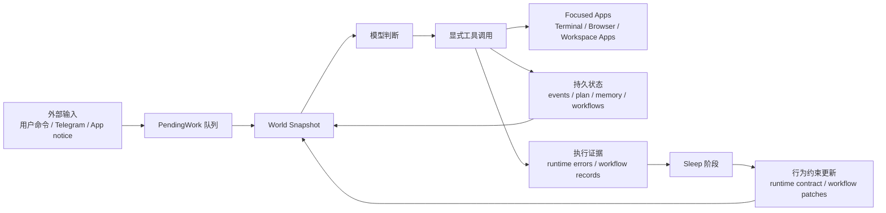

# Daat Locus 架构说明

> 本文是面向使用者、贡献者的公开架构说明。它解释 Daat Locus 为什么这样设计，以及各个核心概念如何协同工作。更细的编码约束、实现边界和贡献规则应参考 `AGENTS.md` 与 `CONTRIBUTING.md`。

Daat Locus 是一个长期运行的本地 agent runtime。它的目标不是把 LLM 包装成一个一问一答聊天机器人，而是把 LLM 放进一个受运行时约束的行动系统中：外部事件进入队列，runtime 渲染当前世界状态，模型做语义判断并调用工具，工具显式改变世界，执行证据再被沉淀到 workflow 和 sleep 阶段中。

换句话说，Daat Locus 的中心不是“对话”，而是**持续运行中的世界状态**。

## 设计目标

Daat Locus 面向那些会从长期实践中变得更好的工作：维护同一个项目、反复处理同一类任务、使用同一组工具完成连续任务、在 human-in-loop 反馈中逐渐贴合使用者的判断方式。

它希望解决几个常见 agent 设计问题：

1. **文本被误当成行动**
   很多 agent 只要模型输出“我已经完成”，系统就默认完成。Daat Locus 不这样做。外部世界的变化必须通过显式工具调用发生。

2. **工具列表平铺导致注意力分散**
   当所有工具都同时暴露给模型时，模型很容易忽略当前正在操作的软件表面。Daat Locus 通过 App 模型让工具被局部化、状态化、可聚焦。

3. **经验只停留在聊天记忆里**
   普通记忆能让 agent 记住发生过什么，但不一定能让它形成更稳定的行动方式。Daat Locus 把反复执行的任务沉淀成 workflow，并在 sleep 阶段基于执行证据持续改进。

4. **自我改进过于泛化**
   Daat Locus 不把 self-improvement 理解为让模型泛泛反思。它把改进拆成不同证据来源：运行时协议错误用于修正全局 runtime contract；workflow 执行记录用于改进可复用任务流程。

5. **人类反馈难以长期复利**
   Daat Locus 的目标不是替代人的判断，而是把高质量 human-in-loop 反馈转化为可执行的长期约束：workflow、测试、工具边界、审批规则和运行时不变量。

## 核心原则

### 文本不是行动

模型输出的自然语言通常只是解释、草稿或中间记录。它不会自动变成外部世界的动作。

如果要回复 Telegram 消息，必须通过事件完成工具。
如果要修改文件，必须通过明确的文件或 patch 工具。
如果要结束一个 app notice，必须通过对应的 resolution 工具。
如果要改变长期 workflow，必须通过 sleep 或受控 workflow 变更流程。

这条原则让 Daat Locus 能够区分：

- 模型说了什么；
- 模型打算做什么；
- runtime 实际记录到什么；
- 外部世界是否真的被改变。

### Runtime 拥有世界状态

Daat Locus 不把聊天上下文当成唯一事实来源。Runtime 会维护和渲染当前世界状态，包括待处理事件、当前计划、已绑定 workflow、前台 App、App 状态、长期记忆召回结果、系统时间与机器状态等。

模型每一轮看到的是经过整理的 world snapshot，而不是一堆未经区分的消息历史。

### 代码负责机械工作，模型负责语义判断

Daat Locus 尽量避免让模型做代码可以稳定完成的机械任务，例如：

- 枚举队列；
- 去重；
- 查找最新事件；
- 维护 outbox；
- 判断某个 id 是否过期；
- 记录 workflow 执行证据；
- 持久化状态。

模型应该做的是语义判断：是否需要回应、应该怎样回应、是否需要聚焦某个 App、是否需要绑定 workflow、下一步应该调用什么工具。

这不是为了削弱模型，而是为了让模型把注意力放在真正需要智能的地方。

### 经验是可执行资产，不只是记忆

Daat Locus 使用长期记忆来保持上下文连续性，但它更重视“可执行经验”：某类任务应该怎样做、哪些步骤容易失败、哪些边界需要更明确、哪些流程值得复用。

这些经验会被建模成 workflow，而不是只写进聊天记忆或 profile。

### 自我改进必须可审计

Daat Locus 的 sleep 阶段不应神秘地“让 agent 变聪明”。任何可持久化的行为变化，都应该能回答：

- 改动来自什么证据；
- 改动影响哪个层级；
- 是全局 runtime contract，还是某类任务 workflow；
- 是否可以回滚；
- 是否需要人类审核。

## 总体运行模型

Daat Locus 的基本循环可以概括为：

1. 外部输入或 App notice 进入 pending work；
2. Runtime 认领一项工作；
3. Runtime 组装当前 world snapshot；
4. 模型基于 snapshot 做判断；
5. 模型通过工具显式行动；
6. Runtime 执行工具并记录结果；
7. 如果工作尚未显式完成，runtime 会继续要求模型处理；
8. 工作完成后，runtime 记录必要的 evidence；
9. Sleep 阶段整理这些 evidence，改进 runtime contract 或 workflow。

这个循环的关键点是：**模型不是 runtime 的唯一事实来源，工具结果和持久状态才是行动是否发生的依据。**

## 核心对象

### Event

Event 是系统已经收到的结构化外部事实。它通常意味着“外部世界发生了某件事，需要 agent 做语义判断”。

Event 不等于聊天窗口，也不等于 App 内部游标。它回答的是：

- 发生了什么；
- 是否需要回应；
- 应以什么 disposition 结束；
- 如果需要回应，应该发送什么最终内容。

以 Telegram 为例，新的 Telegram 消息会被 transport 转换成 Event，然后进入 pending work。模型处理这个事件时，不需要“打开 Telegram App 找消息”；runtime 已经知道是哪条消息、来自哪个 chat、对应哪个 event id。

### PendingWork

PendingWork 是驱动 runtime 下一轮工作的调度单位。它可以来自 Event，也可以来自后台 App notice。

PendingWork 只负责调度，不负责业务判断。它不应该变成另一个隐藏状态机，也不应该承载长期语义。

### World Snapshot

World Snapshot 是模型每轮判断前看到的当前世界摘要。它会把分散的 runtime 状态组织成 agent 可理解的上下文。

典型 snapshot 包括：

- 当前时间和机器状态；
- 当前计划；
- 当前绑定的 workflow；
- 候选 workflow 摘要；
- 待处理事件摘要；
- 当前前台 App 和 App 状态；
- 自动召回的长期记忆；
- 必要的工具使用约束。

Snapshot 的目标不是把所有日志塞给模型，而是提供足够的判断材料，避免模型做无意义的机械探索。

### Plan

Plan 是当前任务的短期执行计划。它用于帮助模型保持步骤意识，但它不是 backlog，不是长期知识库，也不是事件列表。

一个健康的 plan 应该服务于当前任务：接下来要做什么，当前进行到哪一步，完成后是否应该清空。

### Memory

Memory 用于上下文连续性和长期经验召回。它可以帮助模型理解用户偏好、历史背景、项目经验和之前的决策。

但 Memory 不应该被当作即时状态缓存。事件状态、App 状态、workflow 绑定、delivery 状态等应由 runtime 持久化和渲染，而不是依赖模型从记忆里猜。

### Workflow

Workflow 是针对某类可复用任务的执行规范。它不是 App 的说明文档，也不是模型天生能力，更不是当前 plan 的长期副本。

Workflow 回答的问题是：

- 什么类型的任务值得复用稳定流程；
- 通常应按什么顺序推进；
- 什么算完成；
- 遇到阻塞或失败时如何恢复；
- 哪些约束需要反复遵守。

Daat Locus 区分三层概念：

- **WorkflowSpec**：workflow 本身，是一份可被 agent 读取的执行规范；
- **WorkflowBinding**：当前任务是否绑定某个 workflow，是 runtime 状态；
- **WorkflowRunRecord**：白天执行后留下的证据，用于 sleep 阶段改进 workflow。

这种分层很重要。WorkflowSpec 不携带“当前是否 active”这类运行时状态；WorkflowBinding 不应写回 workflow 本身；WorkflowRunRecord 由 runtime 自动记录，不应让模型手写执行日志。

## App 模型

### App 是有状态操作表面

Daat Locus 中的 App 不是普通插件，也不是工具包。App 是 agent 观察和行动时面对的、有状态的运行时表面。

人类使用电脑时，不会从“所有可能操作的全局列表”里挑动作。我们会打开终端，看输出，输入命令，等待结果；或者打开浏览器，看当前页面，点击、跳转，再根据新页面继续操作。

Daat Locus 给 agent 提供类似的交互模型。

一个 App 至少提供三层信息：

- **state**：当前可见状态；
- **usage**：它适合什么时候使用；
- **how_to_use**：聚焦后应该怎样操作。

这三层不应混在一起。State 不是教程；usage 不是完整操作手册；how_to_use 也不是当前世界事实。

### 为什么需要 focus

Focus 不是形式主义。它的作用是让模型的注意力和工具空间局部化。

当 Terminal 被聚焦时，模型关心 shell session、命令输出、stdin、进程是否仍在运行。
当 Browser 被聚焦时，模型关心页面内容、导航状态、元素引用、页面是否加载完成。
当 workspace app 被聚焦时，模型关心该 app 暴露的状态、notice 和局部工具。

这比把所有工具长期暴露给模型更稳定，因为模型总是知道自己正在操作哪个软件表面。

### Terminal 与 Browser

Terminal 是 App，因为它有持续 session、输出等待、stdin 写入、进程终止和工作目录等时间语义。

Browser 是 App，因为页面内容是局部且会变化的；点击、导航、等待加载、重新读取页面都会影响之后能否继续操作。

这两个 App 都说明了 Daat Locus 的核心观点：**工具调用不是孤立函数，而是在某个状态化软件表面上的连续动作。**

### Telegram 这种 im 接口为什么不是 App

Telegram 在 Daat Locus 中是 transport 和 event source，而不是 App。

原因是：当 Telegram 消息到达时，runtime 已经知道足够的结构化事实：消息内容、来源 chat、event id、是否已知联系人等。标准处理路径是“判断并完成这个事件”，而不是“打开一个 Telegram UI、选择 chat、再查找消息”。

如果把 Telegram 建模成 App，系统反而容易引入隐藏游标：当前打开哪个 chat、当前选中哪条消息、发送动作是否依赖界面状态等。这会削弱事件完成的可审计性。

因此，Telegram 消息进入 Event；回复则通过显式 completion 工具进入 outbox，再由 transport 异步投递。

## 工具与行动边界

Daat Locus 把工具视为改变世界状态的显式接口。一个工具调用应该清楚说明：它读取什么、改变什么、需要哪些显式参数、失败时如何记录。

### 显式标识符优先

工具参数应尽量使用明确 id，而不是依赖隐藏的“当前选中对象”。

例如：

- 事件完成应绑定具体 event id；
- Browser 操作应绑定具体 page 和元素引用；
- Terminal 操作应绑定具体 session；
- Workflow 绑定应指向明确 workflow。

这样做的目的是防止 stale state 和隐藏 cursor 造成误操作。

### App-scoped tools

属于某个 App 的工具应只在合适的 App 上下文中暴露和使用。Browser 工具不应在任何上下文中偷偷执行；Terminal 工具也不应绕过 Terminal 的状态表面。

这让模型的每次行动都能回答：“我现在是在操作哪个 App 的哪个状态？”

### Event completion tools

外部事件的最终处理必须通过 completion 工具完成。自然语言文本可以是解释，但不能替代 completion。

这样 runtime 才能知道：事件是否被解决、是否需要发送消息、消息是否进入 outbox、transport 是否投递成功、失败是否需要重试或记录。

## Workflow 与经验复利

Daat Locus 的长期性不只来自记忆，也来自 workflow。

当 agent 反复处理同一类任务时，单纯“记住以前发生过什么”是不够的。更重要的是形成稳定的执行方式：哪些步骤有效，哪些前置判断必要，哪些失败值得提前避免，哪些动作必须接受 human-in-loop 审核。

Workflow 就是这些经验的可执行载体。

### Workflow 不是 prompt

Workflow 可以被模型读取，但它不是普通 prompt。它是 runtime 管理的执行资产，有 id、有适用范围、有流程、有完成标准，也有演化历史。

这意味着 workflow 可以被选择、绑定、记录执行结果，并在 sleep 阶段被修正。

### Builtin workflow 与 workspace workflow

Daat Locus 区分基础内置 workflow 和可演化 workspace workflow。

Builtin workflow 更像基础能力层，通常随代码仓库发布，不应被 sleep 自动修改。
Workspace workflow 是长期实践中沉淀出来的本地执行经验，可以在 human-in-loop 和 sleep 机制下逐步改进。

### Workflow 演化

Workflow 演化的目标不是让 agent 随机重写自己的行为，而是基于真实执行证据修正某类任务的流程。

典型改进包括：

- 增加必要的前置检查；
- 明确完成标准；
- 修正容易反复失败的步骤；
- 增加 human approval 条件；
- 合并重复或高度相似的 workflow。

这种改进不是一次性提示词工程，而是长期维护过程。

## Sleep 阶段

Sleep 是 Daat Locus 的异步整理与改进阶段。它不应该被理解为“模型休息时随便反思一下”。

Sleep 的核心作用是：把白天运行时留下的证据转化为更稳定的后续行为。

### 两类证据

Daat Locus 主要区分两类证据：

1. **运行时协议错误**
   这类错误说明模型违反了全局 runtime contract 或工具协议。例如没有显式完成事件、工具参数不符合 schema、继续了错误的 session、使用了过期引用等。

2. **Workflow 执行记录**
   这类记录来自绑定 workflow 的真实任务执行。它说明某个 workflow 在实际使用中是否顺利，哪些步骤有效，哪里可能需要 patch 或 merge。

### 两条改进路径

Daat Locus 将 sleep 改进拆成两条独立路径：

- **Runtime Error Correction**：修正全局 runtime contract 和工具协议约束，避免同类运行时错误重复发生；
- **Workflow Improvement**：基于 workflow 执行记录改进 workspace workflow，让反复任务流程越来越贴合实践。

这两条路径不能混淆。运行时协议错误不应直接变成某个任务 workflow 的步骤；workflow 执行质量问题也不应随意被归因到全局 prompt 或 runtime contract。

### 为什么不做泛泛反思

泛泛反思容易产生负复利：模型可能把偶然现象固化成规则，也可能把测试过拟合成目标。

Daat Locus 更偏向证据驱动：只有当 evidence 足够明确时，才应改变对应层级的行为资产。能用代码判断的错误，由代码检测；需要人类价值判断的高风险变化，应保留 human approval。

## Human-in-loop 与自我塑形

Daat Locus 并不追求无约束自治。它更适合一种 human-guided self-improvement 模式：人类负责方向、抽象边界、风险判断和最终审批；runtime 负责执行、验证、记录、复盘和沉淀。

这种模式的关键不是让 agent 替代人类判断，而是让高质量人类反馈产生复利。

例如，开发者反复指出：

- 某类修改不能只改 prompt，必须加 runtime guard；
- 高风险路径必须人工审批；
- 工具可见性不仅要在展示阶段控制，也要在执行阶段校验；
- 不要把 transport 建模成 App；
- 不要让模型做代码可以稳定完成的机械工作。

这些反馈如果只停留在聊天里，很快会丢失。Daat Locus 的目标是把它们转化成 workflow、测试、审批规则、运行时约束或文档规范，成为下一次行动的默认结构。

这也是 Daat Locus 和普通一次性 coding agent 的重要差异：它更像一个会长期被使用者塑形的本地维护 runtime。

## 第三方 Workspace App

Daat Locus 支持 source-first 的 workspace app 方向。第三方 App 不是外部黑盒插件，而是位于本地 workspace 中、可被 agent 读取和修改的源代码资产。

这种设计有几个目的：

- 让 app 行为可审计；
- 让 agent 能在 human-in-loop 下修改和维护 app；
- 避免过早引入复杂 ABI 或远程插件系统；
- 保持 usage、how_to_use 与 runtime 代码的分层。

第三方 App 的文档不应塞进 workflow。App 说明的是“这个软件表面是什么、何时使用、如何操作”；workflow 说明的是“某类任务应该怎样完成”。这两者必须分开。

## Daemon 与持久状态

Daat Locus 默认以 daemon 模型运行。前台 TUI、Telegram transport、控制接口和 runtime loop 都围绕同一个长期运行状态工作。

Daemon 模型让 Daat Locus 能够：

- 持续接收外部事件；
- 保持 App、workflow、memory 与 pending work 状态；
- 在用户不主动输入时继续处理后台工作；
- 在 sleep 阶段整理执行证据；
- 提供 attachable 的前台界面。

持久状态通常分为两类：

- **受保护 runtime 状态**：配置、事件、memory、transport state、sleep artifacts 等；
- **可编辑 workspace 资产**：workspace apps、workspace workflows、项目文件等。

这种区分很重要。Runtime 状态不应随意被 agent 当成普通项目文件改写；workspace 资产则可以在受控流程中被 agent 编辑和演化。

## 与常见 agent 形态的区别

### 不以聊天 session 为中心

Daat Locus 可以有对话界面，但它的核心不是 session。它的核心是长期 runtime state、pending work、world snapshot、tool-mediated actions 和 sleep evidence。

### 不以 subagent 为核心

Daat Locus 不默认把任务拆给多个临时 subagent，因为这会削弱责任归属和经验复利。它更倾向于单一权威 runtime，加上多个 App 表面、多个 workflow 资产和必要时的隔离 worker。

如果未来引入 worker，也应是受控分析、评估或 sandbox 执行单元，而不是拥有独立世界状态的第二个主 agent。

### 不把 App 等同于插件

插件通常只是能力扩展；App 则是可聚焦、有状态、能渲染当前状态并暴露局部工具的软件表面。

### 不把自我改进等同于反思文本

Daat Locus 的 self-improvement 不是“写一段我哪里做得不好”。它要求 evidence、归属层级、可持久化资产和可审计变更。

## 总结

Daat Locus 的核心不是“让模型拥有更多工具”，而是让模型在一个长期运行、可审计、可复盘、可被人类塑形的 runtime 中行动。

它的架构可以浓缩成几句话：

- 文本不是行动，工具才改变世界；
- Runtime 拥有世界状态，模型基于 snapshot 做语义判断；
- App 是有状态操作表面，不是平铺工具包；
- Workflow 是可复用执行经验，不是聊天记忆；
- Sleep 消费执行证据，而不是泛泛反思；
- Human-in-loop 不是阻碍自治，而是正向复利的来源。

Daat Locus 的目标不是制造一个脱离人类判断的自治系统，而是构建一个能长期接收反馈、沉淀经验、贴合使用者工作方式的个人 agent runtime。
